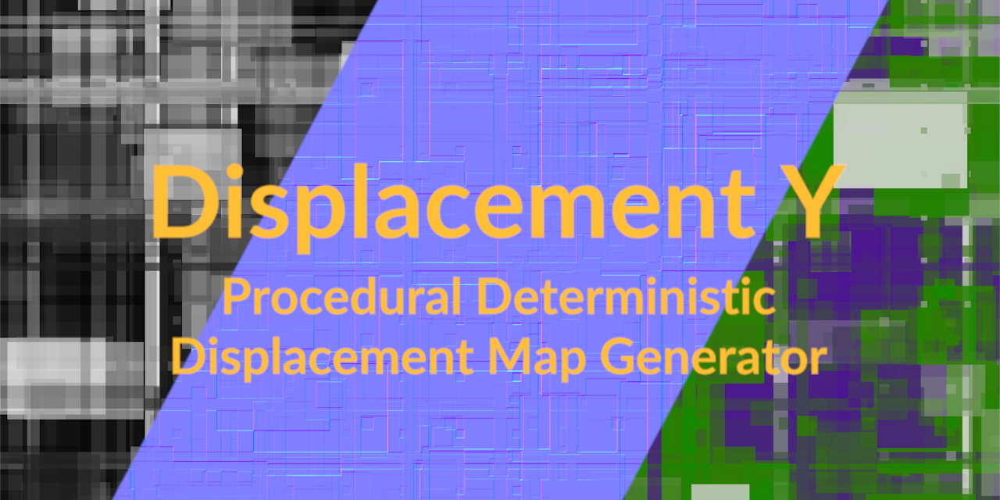

# Displacement Y

Procedural deterministic displacement sci-fi maps generator.

Forked from [Displacement X](https://github.com/satelllte/displacementx)

Live at ▶ **[displacementy.pages.dev](https://displacementy.pages.dev/)**

## FAQ

### What is it used for?

Generated height maps and normal maps can be used in 3D software or game engine, such as Houdini, Blender, Unreal, Unity etc.

### What is the difference between this and `Displacement X`?

Displacement Y is a fork of [Displacement X](https://github.com/satelllte/displacementx), with some extra features and UX changes.

The biggest difference is that Displacement Y is "deterministic", i.e., it will produce the same result with the same settings. This allowed finer control and the sharing of results between sessions or users. You can also tune parameters in lower resolution, then render it in higher resolution later; the result will be visually identical.

You can also lock some of the parameters so that randomization will only effect those that you allowed, providing greater control.

### Why not just work on `Displacement X`? Why the fork and name change?

1. I don't want to go through the whole pull request process. I just want to make some changes for my own need.
2. All the changes are coded by AI and I don't want to "taint" the original code base.

### Any future plans for `Displacement Y`?

There are several features planned, such as custom sprite pack, higher bit depth export, etc., but no promises.

### I want to share my work done with the help of `Displacement Y`. Where can I do that?

I don't have anything setup yet, but feel free to link or attribute this repo or [displacementy.pages.dev](https://displacementy.pages.dev/).

## Contributing

Check out [CONTRIBUTING.md](./CONTRIBUTING.md) guide.
